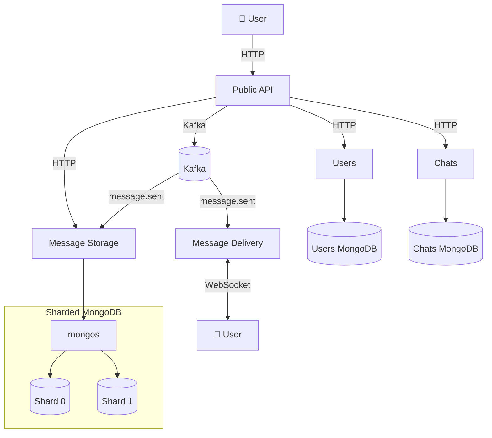

# Messaging Distributed System

This is a distributed messaging system I built to explore how to run a real-time chat platform at scale.

Users can sign up, open 1:1 chats, or create group conversations. I designed it around a 10,000 concurrent-user target.

## Table of contents

- [Architecture](#architecture)
- [Services](#services)
  - [Infrastructure](#infrastructure)
  - [Application](#application)
- [Getting started](#getting-started)
  - [Development workflow](#development-workflow)
  - [Local Kubernetes](#local-kubernetes)
  - [Deploying to AWS (EKS)](#deploying-to-aws-eks)
    - [Step 1. Build the CDK container image](#step-1-build-the-cdk-container-image)
    - [Step 2. Configure CDK context (EKS admin access)](#step-2-configure-cdk-context-eks-admin-access)
    - [Step 3. Preview infrastructure changes (`cdk diff`)](#step-3-preview-infrastructure-changes-cdk-diff)
    - [Step 4. Build and push images to ECR](#step-4-build-and-push-images-to-ecr)
    - [Step 5. Prepare prod deploy (kubeconfig + ECR + cluster add-ons)](#step-5-prepare-prod-deploy-kubeconfig-ecr-cluster-add-ons)
    - [Step 6. Deploy the application (`kubectl apply`)](#step-6-deploy-the-application-kubectl-apply)
    - [Step 7. Create Kafka topics](#step-7-create-kafka-topics)
    - [Cleaning up (EKS)](#cleaning-up-eks)
- [Things to improve](#things-to-improve)

## Architecture



**Public API** is the HTTP entry point for clients. It forwards requests directly to **Users**, **Chats**, and **Message Storage** (for example, sign-up, chat management, and message history).

When a user sends a message, the Public API publishes a `message.sent` event to **Kafka** instead of calling Storage or Delivery over HTTP. **Message Storage** and **Message Delivery** consume that event independently — Storage persists the message; Delivery pushes it to connected clients over WebSocket.

**Users** and **Chats** each persist data in a dedicated single-node MongoDB instance. **Message Storage** writes to a **sharded MongoDB** cluster (via **mongos**); the `messages` collection is sharded on `chat_id`, with two shard replica sets holding the data.

## Services

### Infrastructure

| Service | Description |
|---|---|
| **kafka** | Event broker (`soldevelo/kafka`, Bitnami-compatible). All services publish and consume through Kafka. Runs in KRaft mode (no Zookeeper). |
| **kafka-init** | One-shot container that creates the `message.sent` topic on startup, then exits. Not a second broker — it ensures the topic exists before application services start. |
| **kafka-ui** | Web UI for browsing topics, messages, and consumer groups. Available at http://localhost:8082 |
| **storage-mongodb** | MongoDB instance dedicated to the Message Storage service. |
| **storage-mongo-express** | Web UI for `storage-mongodb`. Available at http://localhost:8083 |
| **chat-mongodb** | MongoDB instance dedicated to the Chat service. |
| **chat-mongo-express** | Web UI for `chat-mongodb`. Available at http://localhost:8086 |
| **users-mongodb** | MongoDB instance dedicated to the Users service. |
| **users-mongo-express** | Web UI for `users-mongodb`. Available at http://localhost:8089 |

### Application

| Service | Language | Port | Description |
|---|---|---|---|
| **public-api** | Rust | 8080 | Public HTTP API. Accepts client requests and publishes `message.sent` events. |
| **chat** | Rust | 8085 | Chat metadata API. Returns chat members and related attributes. |
| **users** | Rust | — | User registration and authentication. Issues JWT tokens. Internal only — exposed via `public-api`. |
| **message-storage** | Rust | — | Consumes `message.sent` and stores message payloads in `storage-mongodb`. |
| **message-delivery** | Rust | 8081 | Maintains WebSocket connections with online clients. Consumes `message.sent` and delivers messages in real time. |
| **frontend** | Next.js | 3000 | Web UI. Dev server with hot reload via `npm run dev`. Available at http://localhost:3000 |

## Getting started

No Rust toolchain is required on the host — everything runs in Docker.

```bash
docker compose up
```

Infrastructure services (Kafka, MongoDB) start first, then the application services.

### Development workflow

Application services use a shared dev image (`services/Dockerfile.dev`) with:

- **Bind mounts** — your source code at `services/<name>/` is mounted into the container
- **`cargo watch`** — rebuilds and restarts automatically when `src/` or `Cargo.toml` changes
- **Cached volumes** — `target/` and the Cargo registry persist between restarts, so dependency builds are not repeated

Edit code on the host; the running container picks up changes without rebuilding the image.

The **frontend** service uses `node:22.15.0-alpine` with the `frontend/` directory bind-mounted. On first run, install dependencies inside the container:

```bash
docker compose run --rm frontend npm install
docker compose up frontend
```

See `.env.example` for configurable environment variables.

### Local Kubernetes

Manifests live under `k8s/` (Kustomize base + `overlays/local` and `overlays/prod`). The overlay deploys application services only; the cluster still needs platform add-ons (ingress controller, MongoDB operator).

**Prerequisites:** a running cluster (Docker Desktop Kubernetes or kind), `kubectl`, and `helm`.

After creating or resetting a cluster, install those add-ons once:

```bash
./scripts/install-cluster-addons.sh
```

The script checks cluster connectivity, installs **ingress-nginx**, and installs the **MongoDB Community Operator** (with CRDs). It is safe to re-run if a component is already present.

Then deploy the app:

```bash
kubectl apply -k k8s/overlays/local
```

Services are exposed via host-based ingress — for example `http://app.localhost` for the frontend (not `http://localhost:3000`). See comments in `k8s/base/ingress.yaml` for all routes and DNS notes.

### Deploying to AWS (EKS)

Infrastructure is defined in `infra/` (AWS CDK). Application manifests are under `k8s/overlays/prod`. The CDK container (`infra/Dockerfile`) bundles the CDK CLI, AWS CLI, and `kubectl` so you do not need them installed on the host.

**Prerequisites**

- Docker
- AWS credentials configured on the **host** (`aws configure`, SSO, or environment variables). The container reads them from `~/.aws` at runtime — configure AWS on the host first, then mount that directory into the container.

Run all commands below from the **repository root**.

#### Step 1. Build the CDK container image

```bash
docker build -t cdk-cli -f infra/Dockerfile infra
```

Verify:

```bash
docker run --rm cdk-cli --version
```

#### Step 2. Configure CDK context (EKS admin access)

The stack maps IAM users to Kubernetes (`system:masters`) via the cluster `aws-auth` ConfigMap so `kubectl` and the EKS console can call the Kubernetes API. Those ARNs are **not** hardcoded — they live in `infra/cdk.context.json` (gitignored, per account).

On first deploy, copy the example and edit if needed:

```bash
cp infra/cdk.context.example.json infra/cdk.context.json
```

The file lists IAM users allowed to administer the cluster:

```json
{
  "messenger": {
    "eksAdminUserArns": [
      "arn:aws:iam::906876370565:user/rafa-cli"
    ]
  }
}
```

CDK reads this file automatically when you run `cdk diff` / `cdk deploy` from `infra/`.

**Requirements for each listed IAM user**

Two layers apply: **AWS IAM permissions** (who may talk to the EKS control plane) and **Kubernetes mapping** (what they may do inside the cluster). CDK only configures the second; you must attach IAM policies in the AWS account yourself.

| Layer | What it does | How it is configured |
|-------|----------------|----------------------|
| **Kubernetes** | Full cluster admin (`kubectl`, EKS Resources tab) | CDK: `system:masters` in `aws-auth` for each ARN in `eksAdminUserArns` |
| **AWS IAM** | Allows `aws eks update-kubeconfig`, EKS console, and Kubernetes API calls | Attach to the IAM **user** in IAM (console or IaC) |

**Minimum IAM permissions** for cluster access (replace `*` with your cluster ARN after deploy if you prefer least privilege):

```json
{
  "Version": "2012-10-17",
  "Statement": [
    {
      "Effect": "Allow",
      "Action": [
        "eks:DescribeCluster",
        "eks:ListClusters",
        "eks:AccessKubernetesApi"
      ],
      "Resource": "*"
    }
  ]
}
```

Alternatively, attach the AWS managed policy **`AmazonEKSClusterAdminPolicy`** scoped to your cluster (same intent, less custom JSON).

#### Step 3. Preview infrastructure changes (`cdk diff`)

```bash
docker run --rm \
  -v "$PWD/infra:/workspace" \
  -v ~/.aws:/root/.aws:ro \
  -w /workspace \
  cdk-cli diff
```

To create or update the EKS cluster, use the same mounts with `deploy` instead of `diff`:

```bash
docker run --rm -it \
  -v "$PWD/infra:/workspace" \
  -v ~/.aws:/root/.aws:ro \
  -w /workspace \
  cdk-cli deploy --all
```

CDK also installs the **Amazon EBS CSI driver** addon and a default **`gp3` StorageClass** so PersistentVolumeClaims can provision EBS volumes.

#### Step 4. Build and push images to ECR

EKS nodes pull application images from Amazon ECR. Build every service image and push it:

```bash
./scripts/build-images.sh --all --push-ecr
```

Requires AWS credentials and a configured region (`AWS_REGION` or `aws configure`). The script creates ECR repositories if needed (one per service name) and pushes tags such as `<account>.dkr.ecr.<region>.amazonaws.com/users:latest`.

For the frontend, URLs are read from `frontend/.env.prod` (edit that file for your domains). EKS nodes are ARM64 (`t4g.large`); images built on Apple Silicon match that architecture automatically.

#### Step 5. Prepare prod deploy (kubeconfig + ECR + cluster add-ons)

Point `kubectl` at the EKS cluster, point manifests at ECR, and install the MongoDB Community Operator (ingress-nginx is skipped — CDK’s AWS Load Balancer Controller handles Ingress on EKS):

```bash
./scripts/prepare-prod-deploy.sh
```

The script lists EKS clusters in the default AWS region: if there is exactly one, it runs `aws eks update-kubeconfig` for it; if there are several, pass `--cluster-name <name>`; if there are none, it exits with an error. Safe to re-run. Edit production hostnames in `k8s/overlays/prod/hosts-configmap.yaml` if needed. EKS nodes pull from ECR in the same account via their IAM role — no `imagePullSecrets`.

#### Step 6. Deploy the application (`kubectl apply`)

```bash
kubectl apply -k k8s/overlays/prod
```

Or run `kubectl` from the CDK container (mount the repo, AWS creds, and kubeconfig):

```bash
docker run --rm \
  -v "$PWD:/repo" \
  -v ~/.aws:/root/.aws:ro \
  -v ~/.kube:/root/.kube:ro \
  -w /repo \
  --entrypoint kubectl \
  cdk-cli apply -k k8s/overlays/prod
```

After deploy, point DNS at the ALB (`kubectl get ingress messaging -o wide`).

**PVC troubleshooting:** if PVCs were created before the EBS CSI driver / default StorageClass existed, delete stuck claims and re-apply:

```bash
kubectl delete pvc --all -A
kubectl apply -k k8s/overlays/prod
```

(`WaitForFirstConsumer` binding is normal: PVCs stay Pending until a pod that uses them is scheduled.)

#### Step 7. Create Kafka topics

Kafka is configured with `auto.create.topics.enable=false`, so create `message.sent` after the broker is Running (same idea as Compose `kafka-init`):

```bash
./scripts/create-kafka-topics.sh
```

This `kubectl exec`s into a Kafka pod and runs `kafka-topics.sh --create --if-not-exists` (2 partitions, replication factor 1 by default). Safe to re-run.

#### Cleaning up (EKS)

Remove workloads from the cluster (reverse of `kubectl apply`):

```bash
kubectl delete -k k8s/overlays/prod
```

Some StatefulSet PVCs (for example sharded MongoDB) are **not** deleted automatically and keep their data on EBS. To wipe all volumes as well:

```bash
kubectl delete pvc -A --all
```

The MongoDB operator is installed separately via Helm. To remove it:

```bash
helm uninstall community-operator -n mongodb-operator
```

Destroy the AWS infrastructure (EKS cluster, node group, ALB controller, etc.):

```bash
docker run --rm -it \
  -v "$PWD/infra:/workspace" \
  -v ~/.aws:/root/.aws:ro \
  -w /workspace \
  cdk-cli destroy
```

Delete the Ingress or the whole prod overlay **before** `cdk destroy`, and wait for the ALB to be removed — otherwise subnet deletion may fail.

For a **local** cluster, remove the app with `kubectl delete -k k8s/overlays/local` instead.

## Things to improve

- **SSL/TLS** — The ingress (ALB) is not configured for HTTPS yet, so traffic reaches the app over plain HTTP. MongoDB connections are also unencrypted; enabling TLS on the server and in client connection strings is a standard production setting for MongoDB.

- **CPU / memory autoscaling** — The Cluster Autoscaler can add nodes when the node group runs out of capacity and pods cannot be scheduled. That is not the same as scaling under load: there is no Horizontal Pod Autoscaler (or similar) to increase replicas when CPU or memory usage is high.

- **Shard Chats** — Messages are already sharded, but the Chats database is still a single MongoDB instance. In a production-grade deployment it would likely need sharding too, since chat metadata is read and updated frequently.

- **Kafka controller / broker** — Kafka currently runs as a single node that acts as both controller and broker. If that instance goes down, the event pipeline stops — separate controller and broker roles (with replication) would be needed for proper high availability.
