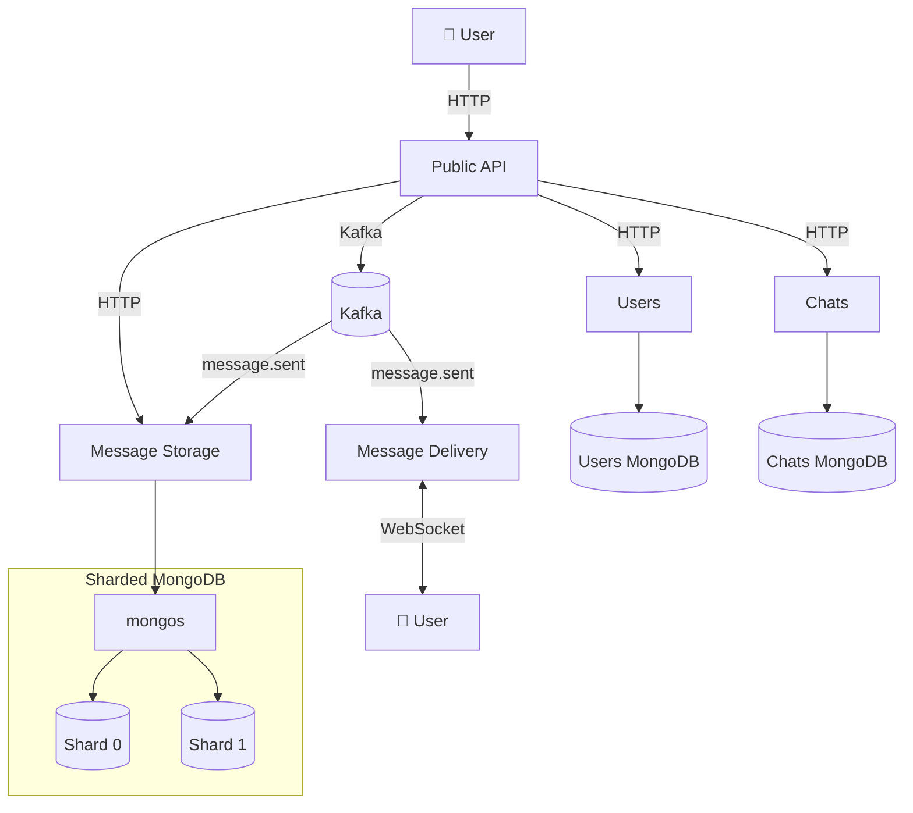

# Messaging Distributed System

This is a distributed messaging system I built to explore how to run a real-time chat platform at scale.

Users can sign up, open 1:1 chats, or create group conversations. I designed it around a 10,000 concurrent-user target.

## Table of contents

- [Architecture](#architecture)
  - [Scalability](#scalability)
  - [High availability](#high-availability)
  - [Cost optimization](#cost-optimization)
- [Observability](#observability)
- [Getting started](#getting-started)
  - [Development workflow](#development-workflow)
  - [Local Kubernetes](#local-kubernetes)
  - [Deploying to AWS (EKS)](#deploying-to-aws-eks)
    - [Step 1. Build the CDK container image](#step-1-build-the-cdk-container-image)
    - [Step 2. Configure CDK context (EKS admin access)](#step-2-configure-cdk-context-eks-admin-access)
    - [Step 3. Preview infrastructure changes (`cdk diff`)](#step-3-preview-infrastructure-changes-cdk-diff)
    - [Step 4. Build and push images to ECR](#step-4-build-and-push-images-to-ecr)
    - [Step 5. Prepare prod deploy (kubeconfig + ECR + cluster add-ons)](#step-5-prepare-prod-deploy-kubeconfig-ecr-cluster-add-ons)
    - [Step 6. Deploy the application (`kubectl apply`)](#step-6-deploy-the-application-kubectl-apply)
    - [Step 7. Create Kafka topics](#step-7-create-kafka-topics)
    - [Cleaning up (EKS)](#cleaning-up-eks)
- [Load testing](#load-testing)
- [Things to improve](#things-to-improve)

## Architecture



**Public API** is the HTTP entry point for clients. It forwards requests directly to **Users**, **Chats**, and **Message Storage** (for example, sign-up, chat management, and message history).

When a user sends a message, the Public API publishes a `message.sent` event to **Kafka** instead of calling Storage or Delivery over HTTP. **Message Storage** and **Message Delivery** consume that event independently — Storage persists the message; Delivery pushes it to connected clients over WebSocket.

**Users** and **Chats** each persist data in a dedicated single-node MongoDB instance. **Message Storage** writes to a **sharded MongoDB** cluster (via **mongos**); the `messages` collection is sharded on `chat_id`.

### Scalability

Application services are deployed with **multiple replicas** and can be scaled further by raising the Deployment replica count (and letting Cluster Autoscaler add nodes when pods stay Pending). That applies to Public API, Users, Chat, Message Storage, Message Delivery, Frontend, and mongos — more pods share request and consumer load without changing how clients talk to the system.

Message volume is the data plane that grows without a natural upper bound. **Message Storage** therefore uses a **sharded MongoDB** cluster: the app talks only to **mongos**, and the `messages` collection is sharded on hashed `chat_id`. Today that is two shard replica sets; as stored messages or write/read pressure grows, additional shards can be added so capacity scales horizontally with the data, not only with app replicas.

### High availability

Replicas are not only for throughput — they also provide redundancy. Prod applies **topology spread constraints** on `topology.kubernetes.io/zone` (`minDomains: 2`): pods of the same service must land in **at least two availability zones**, so a single-AZ outage should not take out every replica. Extra replicas may share an AZ as long as another zone also has at least one pod (for example, three Public API pods might be 2+1 across zones, but never all in one zone).

On the Message Storage data plane, each MongoDB shard and the config servers run as **multi-member replica sets**, and **mongos** is replicated too — so losing one mongod or one router does not take out the whole messages path.

### Cost optimization

On EKS I split capacity into two node groups for cost without putting durable state at risk.

- **Stateless** workloads — Public API, Frontend, Users, Chat, Message Storage (app), Message Delivery, mongos, and the debug UIs — run on **Spot**. Spot is much cheaper than on-demand for the same instance type; if a node is reclaimed, Kubernetes reschedules the pods and clients reconnect (WebSockets included). Workloads opt in with a label; the Spot pool is tainted so nothing lands there by accident.
- **Stateful** workloads — Kafka, MongoDB shards and config servers, embedded Chat/Users MongoDB, and Tempo — stay on **on-demand**. They bind to EBS volumes and need stable process lifetime; Spot interruptions would mean volume reattach races, replica-set churn, and a lot of operational noise for little savings.

mongos is the deliberate exception on Spot: it is only a query router — the data still lives on on-demand shards.

## Observability

The observability stack lives in the `observability` namespace:

| Component | Role |
|---|---|
| **OpenTelemetry Collector** | DaemonSet that receives OTLP from the services (traces and metrics) and forwards them downstream |
| **Tempo** | Trace storage — Explore traces in Grafana |
| **Mimir** | Metrics storage (Prometheus-compatible) |
| **Grafana** | UI for traces and metrics |

Services export to the collector over OTLP (`otel-collector.observability.svc.cluster.local:4317`). There is no log aggregation yet (see [Things to improve](#things-to-improve)).

Grafana is exposed via ingress:

- Local: http://grafana.localhost
- EKS: http://grafana.yourdomain.xyz (hostname comes from `k8s/overlays/prod/hosts-configmap.yaml`)

## Getting started

Local Docker Compose is a single-replica stack (no sharded MongoDB, no observability sidecars). Everything runs in Docker — no Rust toolchain on the host.

```bash
docker compose up
```

Infrastructure (Kafka, MongoDB) starts first, then the application services. The first Rust compile per service can take several minutes; later starts reuse cached `target/` volumes. If several services compile at once and share the Cargo registry volume, a rare unpack race can fail the first build — `cargo watch` usually retries, or run `docker compose restart <service>`.

Once up:

| What | URL |
|---|---|
| Frontend | http://localhost:3000 |
| Public API | http://localhost:8080 |
| WebSocket (delivery) | ws://localhost:8081/ws |
| Kafka UI | http://localhost:8082 |
| Storage Mongo Express | http://localhost:8083 |
| Chat Mongo Express | http://localhost:8086 |
| Users Mongo Express | http://localhost:8089 |

Frontend env for Compose lives in `frontend/.env` (`NEXT_PUBLIC_API_URL=http://localhost:8080`, `NEXT_PUBLIC_WS_URL=ws://localhost:8081/ws`). See `.env.example` for other documented overrides (most values are already set in `docker-compose.yml`).

### Development workflow

Application services use a shared dev image (`services/Dockerfile.dev`) with:

- **Bind mounts** — your source code at `services/<name>/` is mounted into the container
- **`cargo watch`** — rebuilds and restarts automatically when `src/` or `Cargo.toml` changes
- **Cached volumes** — `target/` and the Cargo registry persist between restarts, so dependency builds are not repeated

Edit code on the host; the running container picks up changes without rebuilding the image.

The **frontend** service uses `node:22.15.0-alpine` with the `frontend/` directory bind-mounted. On first run, install dependencies inside the container:

```bash
docker compose run --rm frontend npm install
docker compose up frontend
```

Observability (Grafana, Tempo, Mimir, OTel Collector) is set up for Kubernetes, not this Compose stack.

### Local Kubernetes

Manifests live under `k8s/` (Kustomize base + `overlays/local` and `overlays/prod`). The overlay deploys application services only; the cluster still needs platform add-ons (ingress controller, MongoDB operator).

**Prerequisites:** a running cluster (Docker Desktop Kubernetes or kind), `kubectl`, and `helm`.

After creating or resetting a cluster, install those add-ons once:

```bash
./scripts/install-cluster-addons.sh
```

The script checks cluster connectivity, installs **ingress-nginx**, and installs the **MongoDB Community Operator** (with CRDs). It is safe to re-run if a component is already present.

Then deploy the app:

```bash
kubectl apply -k k8s/overlays/local
```

Services are exposed via host-based ingress — for example `http://app.localhost` for the frontend (not `http://localhost:3000`). See comments in `k8s/base/ingress.yaml` for all routes and DNS notes.

### Deploying to AWS (EKS)

Infrastructure is defined in `infra/` (AWS CDK). Application manifests are under `k8s/overlays/prod`. The CDK container (`infra/Dockerfile`) bundles the CDK CLI, AWS CLI, and `kubectl` so you do not need them installed on the host.

**Prerequisites**

- Docker
- AWS credentials configured on the **host** (`aws configure`, SSO, or environment variables). The container reads them from `~/.aws` at runtime — configure AWS on the host first, then mount that directory into the container.

Run all commands below from the **repository root**.

#### Step 1. Build the CDK container image

```bash
docker build -t cdk-cli -f infra/Dockerfile infra
```

Verify:

```bash
docker run --rm cdk-cli --version
```

#### Step 2. Configure CDK context (EKS admin access)

The stack maps IAM users to Kubernetes (`system:masters`) via the cluster `aws-auth` ConfigMap so `kubectl` and the EKS console can call the Kubernetes API. Those ARNs are **not** hardcoded — they live in `infra/cdk.context.json` (gitignored, per account).

On first deploy, copy the example and edit if needed:

```bash
cp infra/cdk.context.example.json infra/cdk.context.json
```

The file lists IAM users allowed to administer the cluster:

```json
{
  "messenger": {
    "eksAdminUserArns": [
      "arn:aws:iam::906876370565:user/rafa-cli"
    ]
  }
}
```

CDK reads this file automatically when you run `cdk diff` / `cdk deploy` from `infra/`.

**Requirements for each listed IAM user**

Two layers apply: **AWS IAM permissions** (who may talk to the EKS control plane) and **Kubernetes mapping** (what they may do inside the cluster). CDK only configures the second; you must attach IAM policies in the AWS account yourself.

| Layer | What it does | How it is configured |
|-------|----------------|----------------------|
| **Kubernetes** | Full cluster admin (`kubectl`, EKS Resources tab) | CDK: `system:masters` in `aws-auth` for each ARN in `eksAdminUserArns` |
| **AWS IAM** | Allows `aws eks update-kubeconfig`, EKS console, and Kubernetes API calls | Attach to the IAM **user** in IAM (console or IaC) |

**Minimum IAM permissions** for cluster access (replace `*` with your cluster ARN after deploy if you prefer least privilege):

```json
{
  "Version": "2012-10-17",
  "Statement": [
    {
      "Effect": "Allow",
      "Action": [
        "eks:DescribeCluster",
        "eks:ListClusters",
        "eks:AccessKubernetesApi"
      ],
      "Resource": "*"
    }
  ]
}
```

Alternatively, attach the AWS managed policy **`AmazonEKSClusterAdminPolicy`** scoped to your cluster (same intent, less custom JSON).

#### Step 3. Preview infrastructure changes (`cdk diff`)

```bash
docker run --rm \
  -v "$PWD/infra:/workspace" \
  -v ~/.aws:/root/.aws:ro \
  -w /workspace \
  cdk-cli diff
```

To create or update the EKS cluster, use the same mounts with `deploy` instead of `diff`:

```bash
docker run --rm -it \
  -v "$PWD/infra:/workspace" \
  -v ~/.aws:/root/.aws:ro \
  -w /workspace \
  cdk-cli deploy --all
```

CDK also installs the **Amazon EBS CSI driver** addon and a default **`gp3` StorageClass** so PersistentVolumeClaims can provision EBS volumes.

#### Step 4. Build and push images to ECR

EKS nodes pull application images from Amazon ECR. Build every service image and push it:

```bash
./scripts/build-images.sh --all --push-ecr
```

Requires AWS credentials and a configured region (`AWS_REGION` or `aws configure`). The script creates ECR repositories if needed (one per service name) and pushes tags such as `<account>.dkr.ecr.<region>.amazonaws.com/users:latest`.

For the frontend, URLs are read from `frontend/.env.prod` (edit that file for your domains). EKS nodes are ARM64 (`t4g.large`); images built on Apple Silicon match that architecture automatically.

#### Step 5. Prepare prod deploy (kubeconfig + ECR + cluster add-ons)

Point `kubectl` at the EKS cluster, point manifests at ECR, and install the MongoDB Community Operator (ingress-nginx is skipped — CDK’s AWS Load Balancer Controller handles Ingress on EKS):

```bash
./scripts/prepare-prod-deploy.sh
```

The script lists EKS clusters in the default AWS region: if there is exactly one, it runs `aws eks update-kubeconfig` for it; if there are several, pass `--cluster-name <name>`; if there are none, it exits with an error. Safe to re-run. Edit production hostnames in `k8s/overlays/prod/hosts-configmap.yaml` if needed. EKS nodes pull from ECR in the same account via their IAM role — no `imagePullSecrets`.

#### Step 6. Deploy the application (`kubectl apply`)

```bash
kubectl apply -k k8s/overlays/prod
```

After deploy, point DNS at the ALB (`kubectl get ingress messaging -o wide`).

**PVC troubleshooting:** if PVCs were created before the EBS CSI driver / default StorageClass existed, delete stuck claims and re-apply:

```bash
kubectl delete pvc --all -A
kubectl apply -k k8s/overlays/prod
```

(`WaitForFirstConsumer` binding is normal: PVCs stay Pending until a pod that uses them is scheduled.)

#### Step 7. Create Kafka topics

Kafka is configured with `auto.create.topics.enable=false`, so create `message.sent` after the broker is Running (same idea as Compose `kafka-init`):

```bash
./scripts/create-kafka-topics.sh
```

This `kubectl exec`s into a Kafka pod and runs `kafka-topics.sh --create --if-not-exists` (2 partitions, replication factor 1 by default). Safe to re-run.

#### Cleaning up (EKS)

Remove workloads from the cluster (reverse of `kubectl apply`):

```bash
kubectl delete -k k8s/overlays/prod
```

Some StatefulSet PVCs (for example sharded MongoDB) are **not** deleted automatically and keep their data on EBS. To wipe all volumes as well:

```bash
kubectl delete pvc -A --all
```

The MongoDB operator is installed separately via Helm. To remove it:

```bash
helm uninstall community-operator -n mongodb-operator
```

Destroy the AWS infrastructure (EKS cluster, node group, ALB controller, etc.):

```bash
docker run --rm -it \
  -v "$PWD/infra:/workspace" \
  -v ~/.aws:/root/.aws:ro \
  -w /workspace \
  cdk-cli destroy
```

Delete the Ingress or the whole prod overlay **before** `cdk destroy`, and wait for the ALB to be removed — otherwise subnet deletion may fail.

For a **local** cluster, remove the app with `kubectl delete -k k8s/overlays/local` instead.

## Load testing

Since I wanted to ensure this system can operate with around 10,000 concurrent users, I built a fairly demanding load test. Each virtual user authenticates as `user{N}`, opens **3** direct (1:1) chats with random peers, sends **10** messages per chat, then lists those messages — exercising the full path through Public API → Kafka → Storage / Delivery.

Users must exist **before** the load run. Prefer seeding them with `scripts/load-test/seed-users.sh` (idempotent: HTTP 409 counts as success). The Lambda defaults to `SKIP_USER_CREATION=true`, so it assumes nicknames like `user0` … `user{N-1}` are already registered with the shared load-test password.

```bash
./scripts/load-test/seed-users.sh --users 1000
```

<details>
<summary><strong>Password verification during load tests</strong></summary>

This project uses **Argon2** for password hashing and verification. Argon2 is intentionally expensive so offline brute-force attacks are costly.

On the hardware used here, verifying a password takes on the order of **~40 ms** of CPU time (see `docs/performance-tests.md`). Unlike waiting on the network or MongoDB, that work is **CPU-bound**: each verification holds a core for the duration of the hash check.

As a rough estimate, one vCPU can do about **25 verifications per second**. A burst of **10,000 logins** finishing in about **4 seconds** would therefore need on the order of **~100 vCPUs** just for Argon2 — before counting the Public API, Kafka, Chat, Storage, Delivery, and databases that the load test is meant to stress.

The Users service already becomes the bottleneck much earlier when verification is enabled (hundreds of concurrent logins with a small replica count). Scaling auth pods far enough to clear a 10k login wave would burn a lot of Spot/on-demand capacity while teaching little about the rest of the pipeline.

The load tests therefore focus on the messaging path after users exist. Set **`VERIFY_PASSWORDS=false`** on the Users service for those runs (env var; **default is `true`**). Authentication still issues JWTs after looking the user up, but the Argon2 verify step is skipped. Leave verification **enabled** outside load testing.

</details>

Deploy the load-test Lambda with CDK (`MessengerLoadTestStack` — same CDK workflow as the EKS stack above):

```bash
docker run --rm -it \
  -v "$PWD/infra:/workspace" \
  -v ~/.aws:/root/.aws:ro \
  -w /workspace \
  cdk-cli deploy MessengerLoadTestStack
```

Then fire async batch invokes:

```bash
./scripts/load-test/invoke-simulate-users.sh \
  --users 1000 --batch-size 20 --start-in 20
```

`--batch-size` is how many users a **single** Lambda simulates in one invocation. Packing users into fewer, larger invokes cuts the number of Lambdas you launch, which keeps the load test more cost-effective.

`--start-in` (or `--start-at`) sets a shared wall-clock start so every Lambda waits until the same moment before simulating — otherwise early invokes would begin hitting the API while later ones are still being queued.

To evaluate the results of the load test:

- Check the logs and success metrics of the AWS Lambda execution.
- Check in Grafana the Traces to identify 5XX errors or Metrics to locate CPU/memory exhaustion.
- Check AWS Load Balancer to identify HTTP request process exhaustion.

## Things to improve

- **SSL/TLS** — The ingress (ALB) is not configured for HTTPS yet, so traffic reaches the app over plain HTTP. MongoDB connections are also unencrypted; enabling TLS on the server and in client connection strings is a standard production setting for MongoDB.

- **ALB health checks** — Target groups still use the default `GET /` check (success = 200). That works for Public API (which has a root handler), but Message Delivery only exposes `/ws`, so probes get 404 and every replica is marked unhealthy. When all targets fail, the ALB fails open and keeps sending traffic anyway — so the service still works, but the checks do not actually take bad pods out of rotation. Proper `/health` endpoints and per-service `healthcheck-path` annotations would fix this.

- **CPU / memory autoscaling** — The Cluster Autoscaler can add nodes when the node group runs out of capacity and pods cannot be scheduled. That is not the same as scaling under load: there is no Horizontal Pod Autoscaler (or similar) to increase replicas when CPU or memory usage is high.

- **Shard Chats** — Messages are already sharded, but the Chats database is still a single MongoDB instance. In a production-grade deployment it would likely need sharding too, since chat metadata is read and updated frequently.

- **Kafka controller / broker** — Kafka currently runs as a single node that acts as both controller and broker. If that instance goes down, the event pipeline stops — separate controller and broker roles (with replication) would be needed for proper high availability.

- **Logging** — Traces go to Tempo and metrics to Mimir, but there is no log aggregation yet. Adding something like Loki (or similar) would complete the observability stack so logs can be queried alongside traces and metrics.

- **Optional OTel for local Compose** — Rust services always initialize an OTLP exporter. Without a collector (Compose has none today), export attempts fail quietly against the default endpoint. Making telemetry opt-in when `OTEL_EXPORTER_OTLP_ENDPOINT` is unset would keep local logs cleaner.
